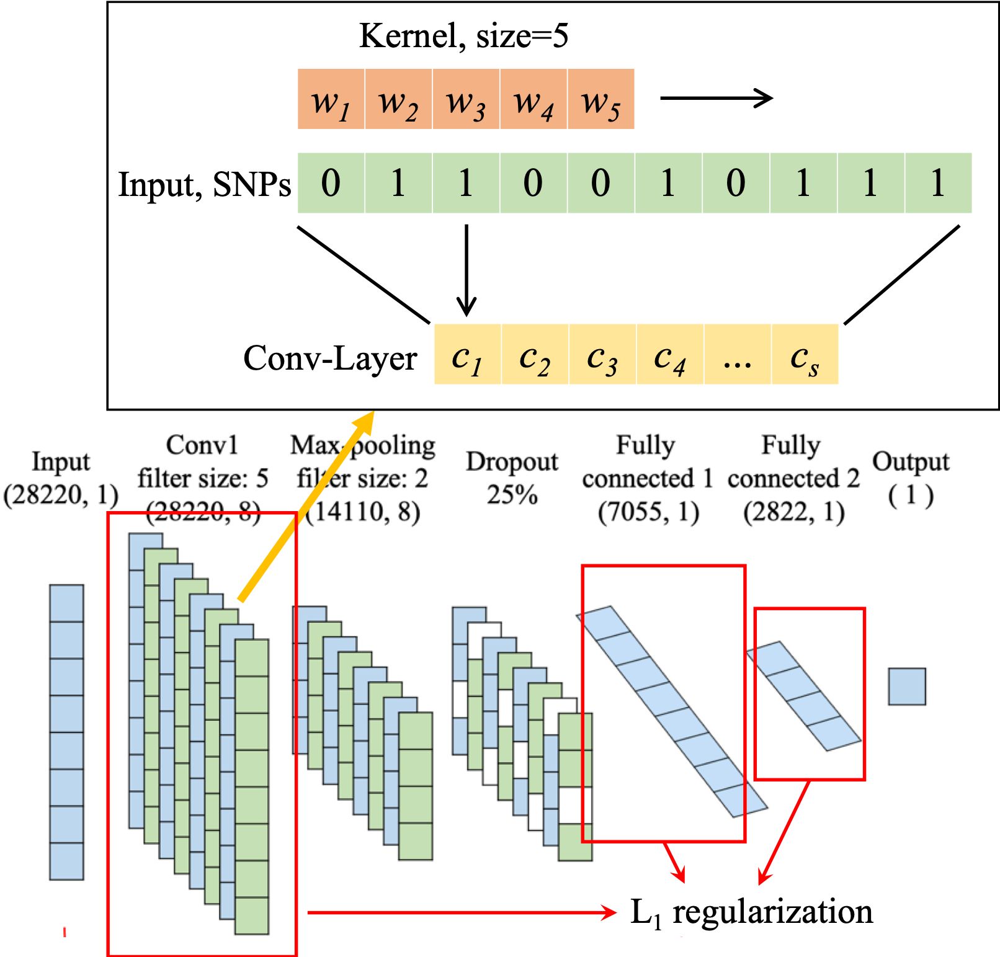
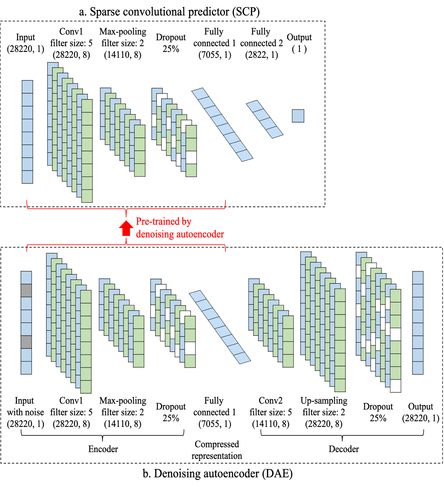

# A Sparse Convolutional Predictor with Denoising Autoencoders for Phenotype Prediction

## Introduction
Phenotype prediction has been widely conducted in many areas to help understand disease risks and susceptibility, and improve the breeding cycles of plants and animals. Most methods of phenotype prediction are based on regularized statistical approaches which only consider linear relationships among genetic features. Deep learning based methods have been recently reported to nicely address regression problems in high dimensional data in genomic studies. To explore deep learning for phenotype prediction, we propose a deep learning regression model, called Sparse Convolutional Predictor with Denoising Autoencoders (SCP_DAE), to predict quantitative traits. We constructed SCP_DAE by utilizing a convolutional layer that can extract correlation or linkage patterns in the genotype data and applying a sparse weight matrix resulted from the L1 regularization to handle high dimensional genotype data. To learn efficient and compressed hidden representations of genotype data, we pre-trained the convolutional layer and the first fully connected layer in SCP_DAE using denoising autoencoders. These pre-trained layers were then fine-tuned to improve its performance of the SCP_DAE model for phenotype prediction. We comprehensively evaluated our proposed method on a yeast dataset which contains well assayed genotype profiles and quantitative traits. Our results showed that the proposed SCP_DAE method significantly outperforms regularized statistical approaches and similar deep learning models without pre-trained weights.


A Sparse Convolutional Predictor             |  A Sparse Convolutional Predictor with Denoising Autoencoders
:-------------------------:|:-------------------------:
 |  

<p align="center"> <strong>Fig. 1.</strong> The architecture of SCP and SCP_DAE for phenotype prediction. </p>


## Getting Started
These instructions will get you a copy of the project up and running on your local machine for development and testing purposes. The code is performed in a Jupyter Notebook, because Jupyter Notebook provides an interactivly develop and test manner, which is very convient for practical purpose. 

### Prerequisites
```
Python >= 3.6 
virtualenv >= 16.4.3
```

### Setup
Create virtual environment
```
git clone https://github.com/shilab/SCP_DAE.git
cd SCP_DAE
mkdir venv
python3 -m venv venv/
source venv/bin/activate
```

Install requirment dependents
```
pip install tensorflow sklearn pandas jupyter matplotlib
```

## Citation  
Junjie Chen and Xinghua Shi. A Sparse Convolutional Predictor with Denoising Autoencoders for Phenotype Prediction. Proceedings of the 10th ACM International Conference on Bioinformatics, Computational Biology and Health Informatics. ACM, 2019.
